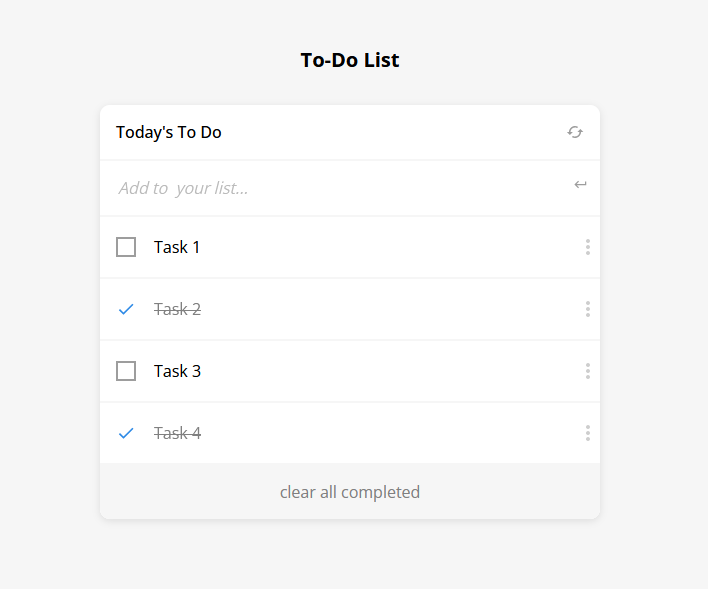

# To Do list

## Overview

In this project, I built a simple HTML list of To Do tasks with focus on it structure using Javascript to load the html elements dynamically. In  addition, I implemented the CRUD (create, read, update, delete) methods as a way to add, remove or update the task list. This simple web page was built using webpack and served by a webpack dev server.

## Project Objectives (Work-in-progress)

### Page Structure

- [x] A new project was setup with webpack that is based on the [webpack exercise](https://github.com/fmanimashaun/webpack-boilerplate) completed earlier.
- [x] Create an index.html file and write your HTML markup here. Create an empty To Do List placeholder using `
` element. The index.html file was set as a template using the HTML Webpack Plugin.
- [x] Create an index.js file and set an array of some simple to do tasks (array of objects). Each task object should contain three keys:

    i.    description [`string`]
    
    ii.   completed [`bool`]
    
    iii.  index: [`number`]

- [x] Created a function to iterate over the tasks array and populate an HTML list item element for each task.
- [x] On page load render the dynamically created list of tasks in the dedicated placeholder. The list appear in order of the index values for each task.
- [x] Create a style.css and set rules for the To Do List. CSS was loaded by Webpack Style/CSS Loader.

## DEMO LINK

> [Live Demo Link](https://fmanimashaun.github.io/To-do-List/)

## Screenshots

<h3 align="center">Screenhot</h3>

  

## Built With

- [HTML](https://developer.mozilla.org/en-US/docs/Web/HTML)
- [JavaScript/ES6](https://262.ecma-international.org/6.0/)
- [CSS](https://developer.mozilla.org/en-US/docs/Web/CSS)
- [webpack 5](https://webpack.js.org/)
- [npm](https://www.npmjs.com/)
- [VS Code](https://code.visualstudio.com/)
- [Git](https://git-scm.com/)
- [GitHub](https://github.com)
- [Stylelinter](https://stylelint.io/)
- [ESLint](https://eslint.org/)
- [Webhint](https://webhint.io/)
- [Lighthouse](https://ethcar.github.io/lighthouse/)
- [SASS](https://sass-lang.com/)

## Getting Started

- [Optional] Install git bash to your machine to enable you to clone this repo.
- install Visual Studio to be able to host a local live version.
- Install a browser to view the local live version.

To get a local copy up and running follow these simple example steps.

### Prerequisites

- Internet connection
- A github account

### Setup

- Open your GitHub account the repository's [link](https://github.com/fmanimashaun/To-do-List)

### Install

- copy the repo's link and clone it by writing `git clone https://github.com/fmanimashaun/To-do-List.git` on your git bash terminal.
- `npm install` to install the dependencies

### Run tests

- run `npm run test` to run the tests.

### Deployment

- run `npm run start` to run it locally.

## Authors

👤 **Engr. Animashaun Fisayo**

- [GitHub](https://github.com/fmanimashaun)
- [Twitter](https://twitter.com/fmanimashaun)
- [LinkedIn](https://www.linkedin.com/in/fmanimashaun/)
- [Website](https://fmanimashaun.com)

## 🤝 Contributing

Contributions, issues, and feature requests are welcome!

Feel free to check the [issues page](../../issues/).

## Show your support

Give a ⭐️ if you like this project!

## 📝 License

This project is [MIT](./LICENSE) licensed.
